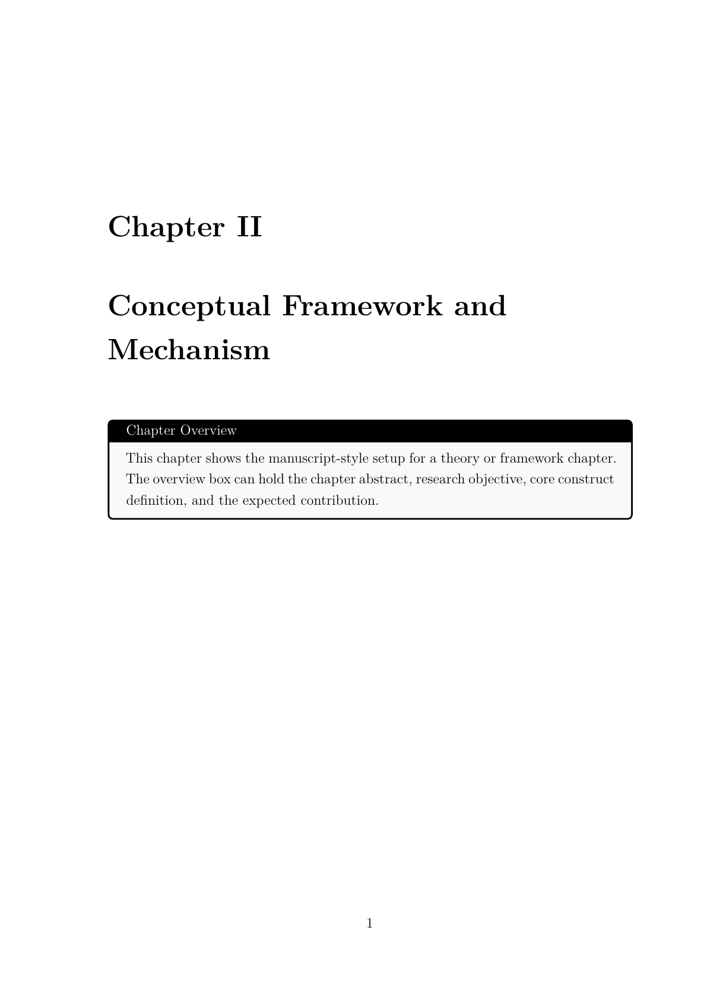

# Templates_PhD_Dauphine

Collection of LaTeX templates for Université Paris Dauphine - PSL. The repository now contains three separate template families:

- a full PhD manuscript template
- a poster template
- a presentation template

The intended workflow is local editing in VS Code, VSCodium, or Cursor with a LaTeX extension such as LaTeX Workshop. The examples below assume a Windows machine, but the LaTeX sources remain portable to macOS and Overleaf.

## Repository overview

```text
Templates_PhD_Dauphine/
|-- README.md
|-- GUIDE.md
|-- Template manuscrit thèse/
|   |-- ATTRIBUTION.md
|   |-- LICENSE
|   |-- main.tex
|   |-- chapter-ch1.tex
|   |-- chapter-ch2.tex
|   |-- chapter-ch3.tex
|   |-- chapter-ch4.tex
|   |-- psl-cover.sty
|   |-- assets/
|   |   |-- cover/
|   |   `-- preview/
|   |-- backmatter/
|   |-- bibliography/
|   |-- ch1/
|   |-- ch2/
|   |-- ch3/
|   |-- ch4/
|   |-- config/
|   `-- frontmatter/
|-- Template poster Dauphine/
|   `-- Poster Template.tex
`-- Template présentation Dauphine/
    `-- Template Dauphine-PSL.tex
```

## Included templates

### 1. Thesis manuscript

The manuscript template is the most complete part of the repository. It includes:

- a full manuscript entry point in `Template manuscrit thèse/main.tex`
- standalone chapter entry points in `Template manuscrit thèse/chapter-ch1.tex` to `Template manuscrit thèse/chapter-ch4.tex`
- one folder per chapter with separate section files
- chapter-level bibliographies through `refsection`
- PSL cover integration through `Template manuscrit thèse/psl-cover.sty`
- front matter, back matter, bibliography, and cover metadata files

Preview images from the manuscript template:

| Manuscript cover | Standalone chapter |
| --- | --- |
|  |  |

Main folders inside `Template manuscrit thèse/`:

- `config/`: shared preamble, cover metadata, and standalone chapter wrapper
- `frontmatter/`: dedication, acknowledgements, table of contents, resume, introduction, list of acronyms
- `ch1/` to `ch4/`: chapter root files and section files
- `backmatter/`: conclusion
- `bibliography/`: bibliography database files
- `assets/cover/`: cover assets
- `assets/preview/`: sample render previews

### 2. Poster

`Template poster Dauphine/` contains a poster source file and the visual assets it references. This template is meant for one-file editing, with the required images stored next to the `.tex` source.

Main entry point:

- `Template poster Dauphine/Poster Template.tex`

### 3. Presentation

`Template présentation Dauphine/` contains a Beamer presentation template styled for Dauphine-PSL, with the logo assets required by the title page and footer.

Main entry point:

- `Template présentation Dauphine/Template Dauphine-PSL.tex`

## Quick start

1. Clone or download the repository.
2. Install a LaTeX distribution that provides `latexmk`, `xelatex`, and `biber`.
3. Choose the template you want to work on.
4. Open the corresponding folder in your editor or build from that folder in a terminal.

Check your setup on Windows:

```text
where latexmk
where xelatex
where biber
```

## Build commands

### Thesis manuscript

Run the following commands from `Template manuscrit thèse/`.

Build the full manuscript:

```text
latexmk -xelatex -synctex=1 -interaction=nonstopmode -file-line-error -outdir=build main.tex
```

Build a standalone chapter:

```text
latexmk -xelatex -synctex=1 -interaction=nonstopmode -file-line-error -outdir=build chapter-ch2.tex
```

Typical outputs:

- `build/main.pdf`
- `build/chapter-ch1.pdf`
- `build/chapter-ch2.pdf`
- `build/chapter-ch3.pdf`
- `build/chapter-ch4.pdf`

### Poster

Run the build from `Template poster Dauphine/` with your usual LaTeX command for the poster source file:

```text
latexmk -pdf -interaction=nonstopmode -file-line-error "Poster Template.tex"
```

### Presentation

Run the build from `Template présentation Dauphine/`:

```text
latexmk -pdf -interaction=nonstopmode -file-line-error "Template Dauphine-PSL.tex"
```

## Editing priorities for the manuscript template

If you are starting from the thesis manuscript template, update these files first:

1. `Template manuscrit thèse/config/cover-metadata.tex`
2. `Template manuscrit thèse/frontmatter/`
3. `Template manuscrit thèse/ch1/` to `Template manuscrit thèse/ch4/`
4. `Template manuscrit thèse/bibliography/references.bib`

## Overleaf workflow

The templates can also be used on Overleaf.

Recommended approach:

1. Create a blank Overleaf project.
2. Upload the folder corresponding to the template you want to use.
3. Set the right main document.
4. Select the appropriate compiler.

Suggested main documents:

- thesis: `main.tex`
- poster: `Poster Template.tex`
- presentation: `Template Dauphine-PSL.tex`

For the manuscript template, keep the internal folder structure unchanged when uploading to Overleaf.

## Documentation

`GUIDE.md` still documents the manuscript workflow in more detail.

Within the manuscript template itself:

- `Template manuscrit thèse/ATTRIBUTION.md`
- `Template manuscrit thèse/LICENSE`

## Attribution

The manuscript template includes a modified copy of Pierre Guillou's PSL thesis cover package. The original copyright and licensing notice remain in `Template manuscrit thèse/psl-cover.sty`.
