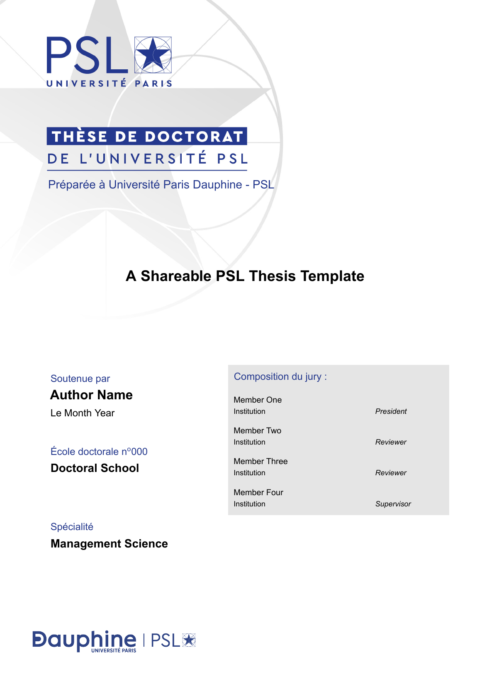

# Templates_PhD_Dauphine

Collection de templates LaTeX pour Université Paris Dauphine - PSL.

Le dépôt contient trois templates distincts:

- un template de manuscrit de thèse
- un template de présentation Beamer
- un template de poster

## Structure du dépôt

```text
Templates_PhD_Dauphine/
|-- README.md
|-- GUIDE.md
|-- Dauphine Thesis Manuscript Template/
|   |-- ATTRIBUTION.md
|   |-- LICENSE
|   |-- main.tex
|   |-- chapter-ch1.tex
|   |-- chapter-ch2.tex
|   |-- chapter-ch3.tex
|   |-- chapter-ch4.tex
|   |-- psl-cover.sty
|   |-- assets/
|   |   |-- cover/
|   |   `-- preview/
|   |-- backmatter/
|   |-- bibliography/
|   |-- ch1/
|   |-- ch2/
|   |-- ch3/
|   |-- ch4/
|   |-- config/
|   `-- frontmatter/
|-- Dauphine Presentation Template/
|   |-- Template Dauphine-PSL.tex
|   |-- logo_dauphine_psl.png
|   `-- logo_dauphine_insigne.png
`-- Dauphine Poster Template/
    `-- Poster Template.tex
```

## Utilisation du Thesis Manuscript Template

Dossier: `Dauphine Thesis Manuscript Template/`

Entrées principales:

- `main.tex` pour le manuscrit complet
- `chapter-ch1.tex` à `chapter-ch4.tex` pour compiler un chapitre seul

Aperçus:

| Couverture manuscrit | Aperçu chapitre |
| --- | --- |
|  |  |

Compilation (depuis `Dauphine Thesis Manuscript Template/`):

```text
latexmk -xelatex -synctex=1 -interaction=nonstopmode -file-line-error -outdir=build main.tex
```

Compilation d'un chapitre:

```text
latexmk -xelatex -synctex=1 -interaction=nonstopmode -file-line-error -outdir=build chapter-ch2.tex
```

Fichiers à personnaliser en priorité:

1. `config/cover-metadata.tex`
2. `frontmatter/`
3. `ch1/` à `ch4/`
4. `bibliography/references.bib`

## Utilisation du Presentation Template

Dossier: `Dauphine Presentation Template/`

Entrée principale:

- `Template Dauphine-PSL.tex`

Visuel de la page de garde (élément principal):


Compilation (depuis `Dauphine Presentation Template/`):

```text
latexmk -pdf -interaction=nonstopmode -file-line-error "Template Dauphine-PSL.tex"
```

## Utilisation du Poster Template

Dossier: `Dauphine Poster Template/`

Entrée principale:

- `Poster Template.tex`

Visuel du poster (élément principal):


Compilation (depuis `Dauphine Poster Template/`):

```text
latexmk -pdf -interaction=nonstopmode -file-line-error "Poster Template.tex"
```

## Vérification de l'environnement (Windows)

```text
where latexmk
where xelatex
where biber
```

## Overleaf

Workflow recommandé:

1. Créer un projet Overleaf vide.
2. Upload uniquement le dossier du template choisi.
3. Définir le bon document principal.

Documents principaux:

- manuscrit: `main.tex`
- présentation: `Template Dauphine-PSL.tex`
- poster: `Poster Template.tex`

## Documentation et attribution

- Guide complet: `GUIDE.md`
- Attribution manuscrit: `Dauphine Thesis Manuscript Template/ATTRIBUTION.md`
- Licence manuscrit: `Dauphine Thesis Manuscript Template/LICENSE`

Le template manuscrit inclut une version modifiée du package de couverture PSL de Pierre Guillou. Le copyright et la licence restent indiqués dans `Dauphine Thesis Manuscript Template/psl-cover.sty`.
